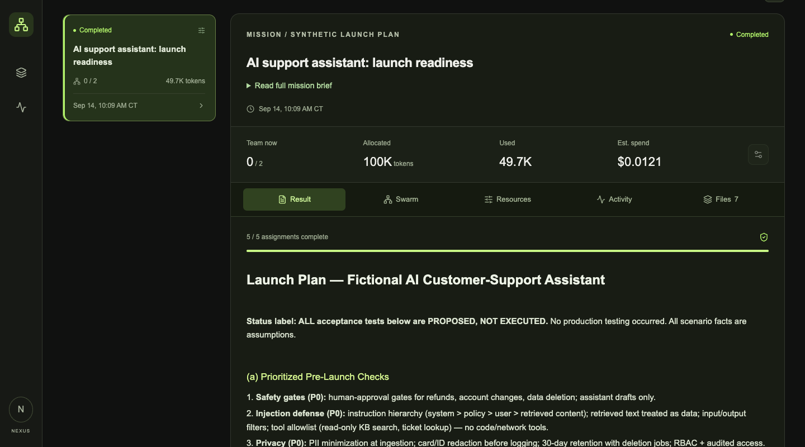
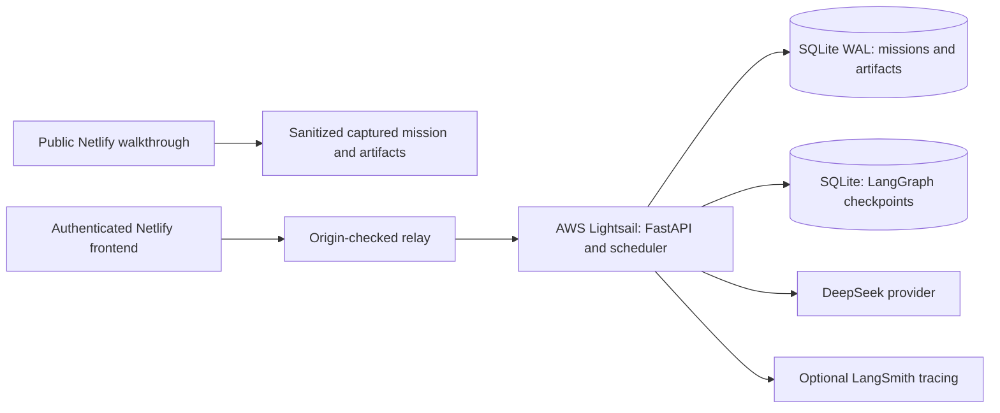
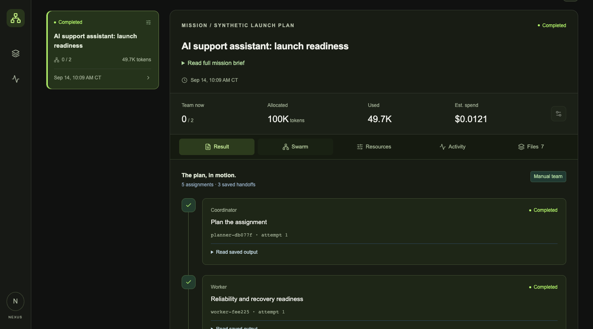

# Swarm Nexus

**Durable multi-agent orchestration with inspectable work, bounded resources and saved deliverables.** Built by Shanto Mathew.

[Explore the public walkthrough](https://shanto-swarm-nexus-showcase.netlify.app/) · [Read the implementation](runtime/backend/swarm/engine.py) · [Verification](docs/VERIFICATION.md)



*Actual application screenshot. The public walkthrough is a read-only capture of a completed cloud execution; launching new missions requires access to the authenticated runtime.*

## Review it in two minutes

Open the walkthrough, inspect **Swarm** to see the assignments, review **Resources** and **Activity**, then download `launch-plan.md` from **Files**. No login or provider credentials are required for this public review.

The featured workflow planned a launch for a fictional AI support assistant: a planner, reliability and security workers, synthesis, and independent verification. All **five assignments completed**, producing **seven byte-verified artifacts** with **49,706 reported tokens** and zero uncertain usage. Proposed acceptance tests inside the plan were not executed against a real support system.

## What I built

- **Durable execution:** a FastAPI mission service, SQLite state and LangGraph checkpoints preserve work beyond the browser session.
- **Resource-aware scheduling:** dependencies, concurrency ceilings, leases, token reservations and bounded retries govern assignment admission.
- **Inspectable outcomes:** the React workspace exposes results, handoffs, activity and downloadable artifacts; the live interface refreshes status by polling.
- **Recovery and verification:** paid response checkpoints can publish without another provider request; independent verification may request bounded repair. A reservation-contention defect was fixed without erasing paid attempts or uncertain accounting.

## Cloud and data architecture



The verified live runtime uses an **AWS Lightsail instance**, with a systemd-managed service behind HTTPS. The public frontend is hosted on **Netlify**. The runtime is one application replica; this project does not claim RDS, ECS, autoscaling or multi-host failover.

| Data / responsibility | Implementation |
| --- | --- |
| Missions, assignments, events, artifacts and handoffs | [SQLite store](runtime/backend/swarm/store.py), with WAL, full synchronous writes and foreign keys |
| Token usage, leases and reservations | Transactional tables in the same store; bounded admission preserves uncertain usage |
| Execution checkpoints | [LangGraph `AsyncSqliteSaver`](runtime/backend/swarm/engine.py) in a separate checkpoint database |
| Owner sessions and access | [FastAPI authentication](runtime/backend/swarm/api.py), hashed session tokens and origin checks |
| Public review data | [Captured synthetic mission](lib/capture/mission.json) and [downloadable artifacts](public/capture/artifacts); no private database access |

Tools are restricted to public HTTP retrieval, arithmetic, artifact reads/writes and internal handoffs. No arbitrary shell, payment, deployment or external messaging tool is provided. Credentials and production infrastructure inventory are excluded from this standalone source publication.

## Run locally

Node.js 22.13+ is required. The default capture makes no paid model calls.

```sh
npm ci
npm run dev
```

For a live runtime, use Python 3.11+, `uv`, your own provider credentials and persistent storage. [Runtime setup](docs/SETUP.md) covers the owner password hash, HTTPS/origin configuration and relay wiring. [.env.example](.env.example) contains placeholders only. The [authenticated workspace](https://swarm-nexus-shanto.netlify.app/) remains owner-controlled.

## Evidence and code tour

The published checkout passed **55 runtime tests**, **14 proxy/security tests**, type checking, build and a zero-vulnerability production npm audit during the September 14, 2026 release. Production browser checks cover desktop/mobile, tabs, artifacts, network/console and security headers. Native Chrome verified the public walkthrough and a downloaded artifact hash; featured live execution was verified through authenticated API/backend evidence. See the [full scope and receipts](docs/VERIFICATION.md).



Start with [the scheduler](runtime/backend/swarm/engine.py), [durable store](runtime/backend/swarm/store.py), [reservation regression tests](runtime/backend/tests/test_reservation_wait.py), [workspace](app/workspace.tsx) or [relay boundary](lib/proxy.ts).

This is independent personal work with synthetic portfolio data. Screenshots depict actual application state. Generated orbit artwork is a visual accent; no customer deployment or broad production-readiness claim is implied.
