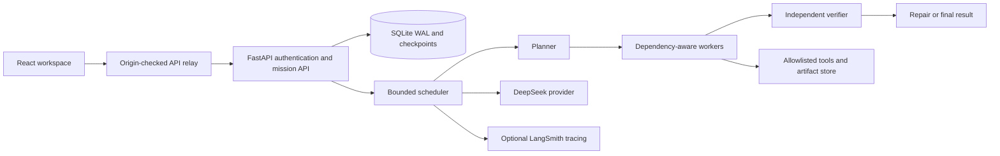

# Swarm Nexus

**A persistent multi-agent workspace, built by Shanto Mathew.**

Turn an outcome into a dependency graph, run bounded workers, preserve their artifacts and handoffs, and independently verify the result. The React interface makes the plan, token policy, activity ledger and deliverables inspectable.

- [Public interactive walkthrough](https://shanto-swarm-nexus-showcase.netlify.app/) — a clearly labelled captured execution, with real saved artifacts and no login required.
- [Authenticated live workspace](https://swarm-nexus-shanto.netlify.app/) — owner access is required to launch paid cloud work.
- [Shanto's portfolio](https://shantomathew.com/)

This repository is an intentionally sanitized publication of personal project source. It contains the frontend, Python runtime and tests, with deployment endpoints parameterized. It contains no production credentials, private mission database, customer data, infrastructure inventory or original repository history.

## Why this project

A useful agent system needs more than parallel prompts. Work has dependencies, tools fail, calls consume reservations, and an interrupted browser must not lose a mission. Nexus connects durable orchestration with a result-first interface so an operator can inspect what happened and decide when to continue.

The captured arithmetic mission is intentionally deterministic: independent workers calculate 17 × 19 and 23 × 29, a writer combines them, and a verifier independently checks the total, 990. This makes correctness testable while demonstrating real provider calls, persistent assignments, handoffs, a budget stop and continuation, and downloadable artifacts. The walkthrough never simulates a live connection or grants public access to the owner's workspace.

## Architecture



The authenticated deployment runs on a persistent AWS service, separate from the Netlify frontend. It is **one application replica** with SQLite WAL, not an autoscaling or highly available distributed cluster. The default global pool limit is eight concurrent assignments. Agent count is a concurrency ceiling, not a promise that every worker runs simultaneously.

Tools are limited to public HTTP retrieval, arithmetic, dependency/artifact reads, saved text artifacts and internal handoffs. There is no arbitrary shell, external messaging, payment, or deployment tool. Authentication, origin validation, secure cookies, download handling, token reservations and retry bounds are explicit boundaries.

## Run the public walkthrough

Requires Node.js 22.13 or later.

```sh
npm ci
npm run dev
```

Open the Vite URL. By default the UI reads only `public/capture/mission.json` and local captured files. Refreshing, changing tabs and downloading an artifact do not invoke an AI provider. `npm run build` creates `dist-netlify/`; the included Netlify configuration hosts this static walkthrough. No live API function is deployed by this default configuration.

## Run your own authenticated runtime

Requires Python 3.11+ and `uv`. Use your own credentials and persistent storage. Copy `.env.example` to an untracked environment file and configure the variables; the example contains placeholders only. The application does not automatically load an env file: inject variables with your process manager or shell.

```sh
cd runtime
uv sync --frozen
PYTHONPATH=backend uv run uvicorn swarm.api:app --host 127.0.0.1 --port 8001
```

Set `SWARM_OWNER_EMAIL`, `SWARM_PASSWORD_HASH`, `SWARM_PUBLIC_ORIGIN`, `SWARM_DB_PATH` and `DEEPSEEK_API_KEY`. The password-hash format is `scrypt$16384$8$1$salt_hex$key_hex`, with at least 16 salt bytes and a 32-byte derived key; `backend/tests/test_api.py` demonstrates the format with a test-only password. For local HTTP only, set `SWARM_COOKIE_SECURE=false`. Keep secure cookies enabled in production. Serve the runtime behind HTTPS.

To connect the full interface, build with `VITE_SHOWCASE=false`; copy `integrations/api.mts` into your Netlify functions folder, adjusting its import for that location, enable that folder in your own Netlify configuration, remove the static `/api/*` denial rule, and set `NEXUS_RUNTIME_ORIGIN` to your HTTPS runtime. Set `SWARM_PUBLIC_ORIGIN` to the same frontend origin. Neither backend tokens nor owner passwords belong in frontend environment variables. The retained relay tests show the origin/cookie/redirect contract. The public showcase intentionally does not make these changes.

The provider model in this captured deployment reports `deepseek-v4-flash`. Provider aliases and availability can change; confirm your account's supported model before deploying your own runtime. Optional LangSmith settings are server-side only. Do not treat a configured tracing flag as evidence that traces arrived.

## Verification

```sh
npm run typecheck
npm test
npm run build
npm audit --omit=dev
cd runtime
PYTHONPATH=backend uv run --frozen pytest backend/tests -q
```

See [verification evidence](docs/VERIFICATION.md) for dated public deployment and original authenticated runtime checks, including what was automated and what was checked in the owner's real Chrome profile. Captured estimates are not provider invoices. Tests and a successful deployment do not imply broad production readiness, HA, unlimited execution, or external-system integrations.

## Source map

- `app/workspace.tsx`: mission creation, resource policy, mission views and operator controls.
- `lib/client.ts`, `lib/showcase.ts`: live API transport versus explicit captured mode.
- `lib/proxy.ts`, `lib/security.ts`: origin, cookie, route and response-security boundaries.
- `runtime/backend/swarm/engine.py`, `store.py`: orchestration, durable state, scheduling and accounting.
- `runtime/backend/swarm/provider.py`, `tool_registry.py`: provider protocol and constrained tools.
- `runtime/backend/swarm/observability.py`: optional tracing hooks.
- `public/capture/`: sanitized synthetic mission response and actual saved artifacts.

The orbit artwork was AI-generated for this project; it is a visual accent, not a scientific diagram. Interface screenshots and captured mission outputs are from the actual application. This is independent work, not employer code or a customer deployment.
